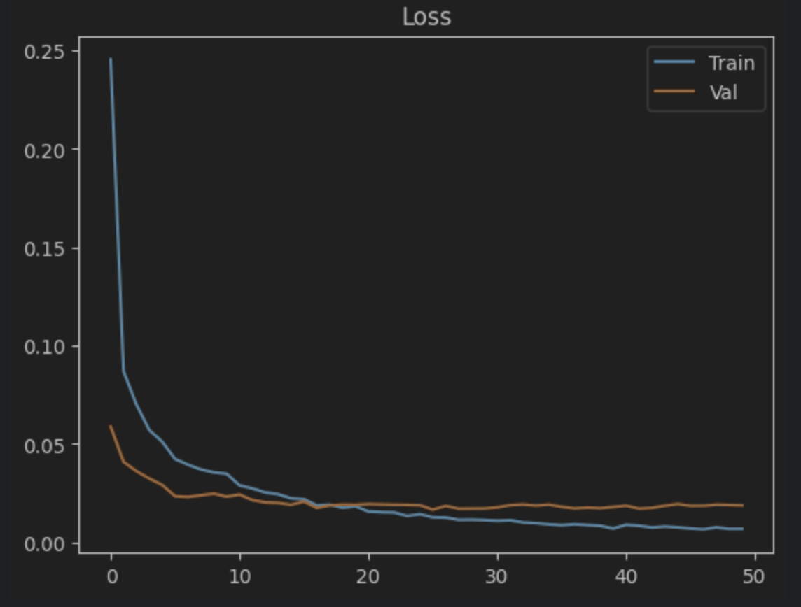

# Kaggle Digit Recognizer

Machine Learning & Deep Learning project on the [Kaggle Digit
Recognizer](https://www.kaggle.com/c/digit-recognizer) competition (Top
10%).\
Goal: recognize handwritten digits (MNIST) from 28×28 images.


------------------------------------------------------------------------

## Data Setup

To run the notebooks, you need to manually download the dataset from Kaggle:  
👉 [Digit Recognizer Dataset](https://www.kaggle.com/c/digit-recognizer/data)

- Place **`train.csv`** and **`test.csv`** inside the `data/` folder at the root of the project.

Expected structure:
------------------------------------------------------------------------

## Project Structure

    digit-recognizer/
    │── data/                
    │   ├── train.csv
    │   └── test.csv
    │── notebooks/
    │    ├── 01_preprocessing.ipynb
    │    ├── 02_baseline_logistic_regression.ipynb
    │    └── 03_cnn_best_model.ipynb
    │── results/submission.csv        # Example Kaggle submission
    │── README.md

-   **01_preprocessing.ipynb** → Data loading, exploration,
    normalization, train/val split, saving in `.pkl` (ML) and `.npy`
    (DL).\
-   **02_baseline_logistic_regression.ipynb** → Machine Learning
    baseline (logistic regression) as a simple ML test case.\
-   **03_cnn_best_model.ipynb** → Optimized CNN in PyTorch, with
    learning rate scheduler and generation of `submission.csv`.

------------------------------------------------------------------------

## Installation

Create a virtual environment (Python ≥3.10 recommended) and install
dependencies:

``` bash
pip install -r requirements.txt
```

Minimal `requirements.txt` example:

    numpy
    pandas
    matplotlib
    scikit-learn
    torch
    torchvision

------------------------------------------------------------------------

## Usage

### 1. Data Preprocessing

Run `01_preprocessing.ipynb` to: - Normalize images, - Create train/val
splits, - Save ML and DL ready datasets.

### 2. Machine Learning Baseline

Run `02_baseline_logistic_regression.ipynb` to: - Train a logistic
regression model, - Reach accuracy ≈ **92--94%**, - Visualize the
confusion matrix.

### 3. Deep Learning (CNN)

Run `03_cnn_best_model.ipynb` to: - Train an optimized CNN in PyTorch, -
Reach validation accuracy ≈ **99%+**, - Generate a `submission.csv` for
Kaggle.

------------------------------------------------------------------------

## Results

-   **Logistic Regression**: \~93% validation accuracy


-   **Optimized CNN**: \~99.3--99.5% validation accuracy




Example of misclassification:


------------------------------------------------------------------------

## Possible Improvements

-   Test-Time Augmentation (TTA) for more robust predictions.\
-   Ensemble of multiple CNN models to boost Kaggle score.\
-   Hyperparameter optimization (Optuna, Ray Tune).\
-   Testing other architectures (ResNet, Vision Transformers).

------------------------------------------------------------------------

## Kaggle Submission

After training the CNN (`03_cnn_best_model.ipynb`), a `submission.csv`
file is generated.\
Expected Kaggle format:

  ImageId   Label
  --------- -------
  1         2
  2         0
  3         9
  ...       ...

------------------------------------------------------------------------

Kaggle Accuracy: 0.99517

Leaderboard: **105/921**


